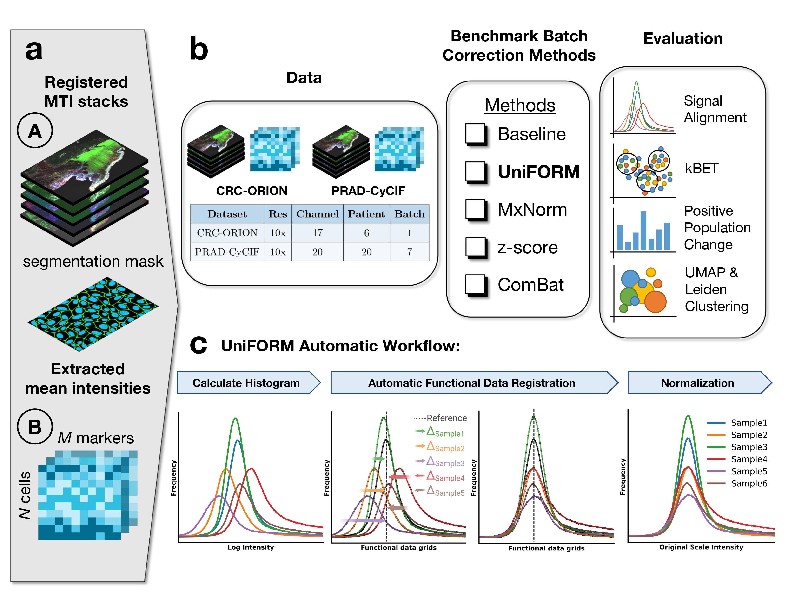

# UniFORM: Universal ImmunoFluorescence Normalization for Multiplex Tissue Imaging


## :star2: About the Project

### :camera: Overview

UniFORM normalization pipeline operates both on pixel-level and feature-level, enabling robust, scalable preprocessing for high-dimensional CyCIF data. This pipeline allows users to normalize CyCIF images and data across multiple samples to facilitate comparative and quantitative analysis.




### :dart: Tech Stack

<ul>
    <li>numpy</li>
    <li>matplotlib</li>
    <li>pandas</li>
    <li>dask</li>
    <li>zarr</li>
    <li>scikit-image</li>
    <li>tifffile</li>
    <li>pyometiff</li>
    <li>scikit-learn</li>
    <li>scipy</li>
    <li>scikit-fda</li>
</ul>

## 	:toolbox: Getting Started

<!-- Installation -->
:gear: Installation

You can install the latest version of the packages above using environment.yml
```bash
git clone https://github.com/kunlunw/uniform_cycif.git
cd uniform_cycif
conda env create -f environment.yml
conda activate cycif-normalization-env
```

OR

Install through PyPI: <a>https://pypi.org/project/uniform-cycif/<a/>

```bash
pip install uniform-cycif
```

:test_tube: Workflow
```UniFORM-calculate-histogram``` -> ```UniFORM-landmark-finetuning (optional)``` --> ```UniFORM-normalization```

### Usage

```
# Importing the Package
import uniform_cycif

# 1. Initialize the model with your AnnData object
uniform_model = uniform_cycif.UniFORM(adata=combined_adata)

# 2. Calculate histograms for specific markers
results_range, results_hist, gmm_curves = uniform_model.uniform_calculate_histogram(
    adata=combined_adata,             # anndata object
    marker_to_plot=["CD45", "ECAD"],  # Markers to process, to process all markers, do not flag this argument
    rep="X"                           # Use raw data
)

# 4. Optional step to perform landmark finetuning
uniform_model.normalize_and_plot_distributions_plotly(
    adata=combined_adata,               # anndata object
    histograms=results_hist,            # Histograms from the previous step
    gmm_curves=gmm_curves,              # GMM curves for each marker and sample
    markers_to_plot=["CD45", "ECAD"],   # Markers to include in the plot
    output_path="/path/to/output",      # Directory to save output HTML files
)

# 5. Normalize data and calculate FFT-based shifts
shifts_fft_dict = uniform_model.normalize_and_plot_distributions(
    adata=combined_adata,               # anndata object
    histograms=results_hist,            # Histograms from the previous step
    markers=["CD45", "ECAD"],           # Markers to process
    reference=references,               # Reference sample for each marker
    landmarks=user_landmark,        # Optional fine-tuned landmarks for normalization, don't flag this for fully automatic pipeline
)

shift_in_log_pixels_dict = uniform_model.calculate_shift_in_log_pixels(
    data_range=range_dict,              # Data range dictionary
    shifts_fft_dict=shifts_fft_dict,    # Shifts from the previous step
)

# 6. Normalize data and save the output to an AnnData object
uniform_model.generate_normalized_feature(
    shift_in_log_pixels_dict=shift_in_log_pixels_dict,  # Shift values
    reference_sample=references,                        # Reference samples for each marker
    output_directory="/path/to/output"                  # Output directory for AnnData
)


```

