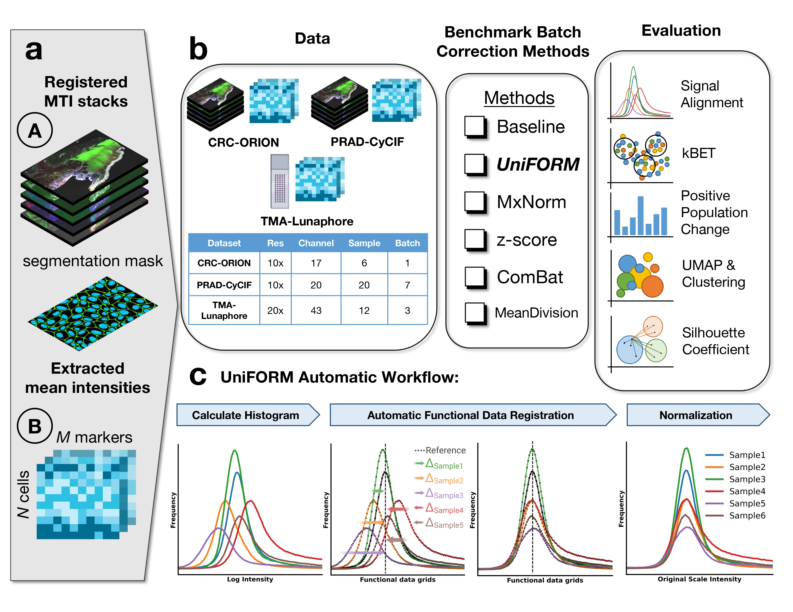
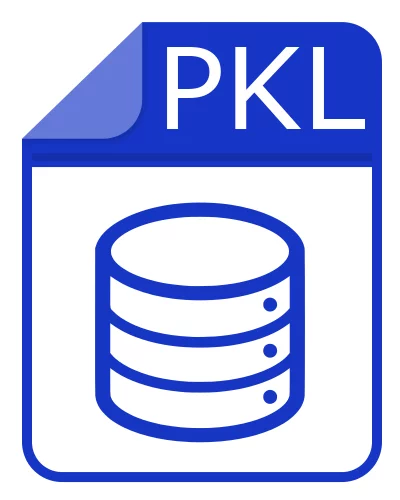

<div align="center" style="margin:0; padding:0;">
  
</div>

<!-- Title immediately after, also resetting margins -->
<div align="center"
     style="
       margin: 0;
       padding: 0.5em 0;
       font-size: 2em;       /* same as GitHub’s h1 */
       font-weight: normal;  /* override the default bold */
     ">
  <strong><em>UniFORM</em></strong>: 
  <strong>Uni</strong>versal Immuno<strong>F</strong>luorescence 
  N<strong>OR</strong>malization for <strong>M</strong>ultiplex Tissue Imaging
</div>


This is the GitHub Repository for article "UniFORM: Towards Universal ImmunoFluorescence Normalization for Multiplex Tissue Imaging" DOI: [10.1101/2024.12.06.626879](https://pubmed.ncbi.nlm.nih.gov/39713407/)


## :star2: Highlights

1. **UniFORM** normalizes both feature‑ and pixel‑level multiplex‐imaging data.  
2. Applies **automatic rigid‐landmark functional registration** to align signal distributions while preserving biological integrity.  
3. **Outperforms existing methods** by:  
   - Preserving overall distribution shape  
   - Maintaining mutual exclusivity of co‑expressed markers  
   - Improving clustering consistency  
   - Enhancing batch mixing (kBET)  
4. Achieves **robust batch correction** across CyCIF, ORION, and COMET platforms, enabling more reliable downstream analyses.  





## Feature-Level Normalization Inputs

UniFORM’s feature‐level pipeline accepts two formats. Choose the one that fits your workflow:

<div align="center">
  <table >
    <tr>
      <td align="center">
        <!-- Placeholder for AnnData logo -->
        
        <p><strong>AnnData<br/><code>.h5ad</code></strong></p>
      </td>
      <td align="center">
        <!-- Placeholder for Pickle logo -->
        
        <p><strong>Pickle Files<br/><code>.pkl</code></strong></p>
      </td>
    </tr>
  </table>
</div>

---

## Pixel-Level Normalization Inputs

UniFORM’s pixel‐level pipeline supports high‐content microscopy formats:

<div align="center">
  <table >
    <tr>
      <td align="center">
        <!-- Placeholder for OME‑TIFF logo -->
        
        <p><strong>OME‑TIFF<br/><code>.ome.tiff</code></strong></p>
      </td>
      <td align="center">
        <!-- Placeholder for TIFF logo -->
        
        <p><strong>TIFF<br/><code>.tiff</code></strong></p>
      </td>
    </tr>
  </table>
</div>


## :toolbox: Dependencies

<ul>
    <li>anndata</li>
    <li>numpy</li>
    <li>pandas</li>
    <li>matplotlib</li>
    <li>plotly</li>
    <li>scikit-fda</li>
    <li>scikit-learn</li>
    <li>scipy</li>
</ul>


## :cloud: Downloading the Data

Before you begin normalization, download the example datasets:

| Dataset Type                     | Format           | Download Link                                                          |
|----------------------------------|------------------|--------------------------------------------------------------------------------|
| **Feature‑Level (Pickle)**       | `*.pkl` files    | ``           |
| **Feature‑Level (AnnData)**      | `*.h5ad` file    | ``           |
| **Pixel‑Level (OME‑TIFF)**       | `*.ome.tiff`     | ``             |


## :gear: Getting Started

Follow these steps to set up **UniFORM** in a fresh, isolated environment:

1. **Clone the repository** 
    ```
    $ git clone https://github.com/kunlunW/UniFORM.git 
    ``` 
2. **Enter the project directory** 
    ```
    $ cd UniFORM  
    ```
3. **Create a new virtual environment** 
    ```
    $ conda create -n UniFORM-env python=3.8
    ```  
4. **Activate the environment**  
    ```
    $ conda activate UniFORM-env
    ```
5. **Install dependencies** 
    ```
    $ pip install -r requirements.txt  
    ```
Once installation completes, choose your tutorial based on the normalization pipeline and input format:

#### Feature-Level Normalization

- **AnnData input**  
  Follow [PRAD_prostate_feature-level-anndata-version.ipynb](notebooks/PRAD_prostate_feature-level-anndata-version.ipynb)

- **Pickle input**  
  Follow [PRAD_prostate_feature-level-pickle-version.ipynb](notebooks/PRAD_prostate_feature-level-pickle-version.ipynb)

#### Pixel-Level Normalization

- Follow [PRAD_prostate_pixel-level.ipynb](notebooks/PRAD_prostate_pixel-level.ipynb)
 

Happy normalizing! 🎉
-KW
